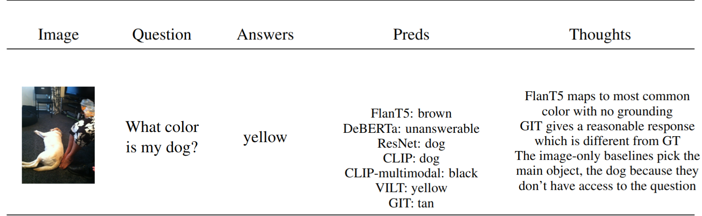
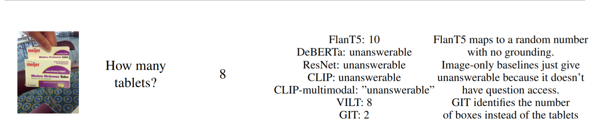
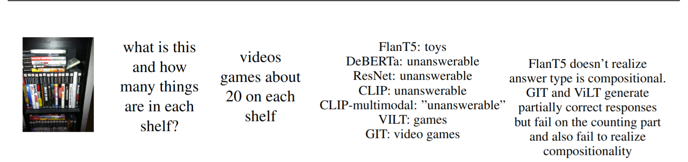
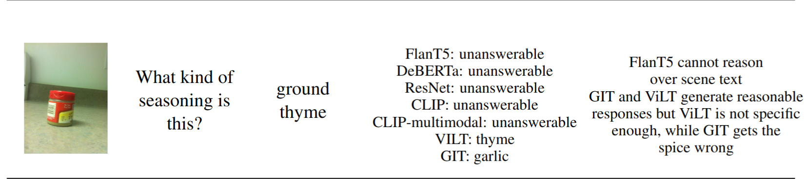
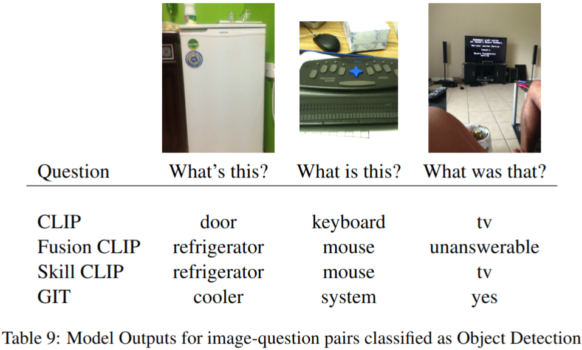
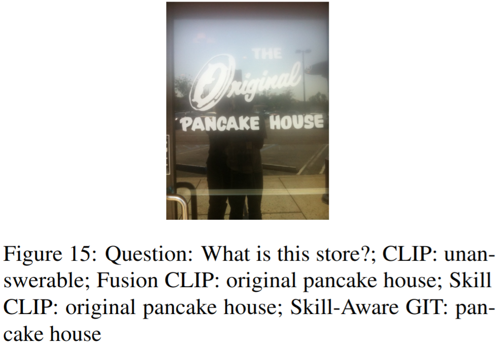
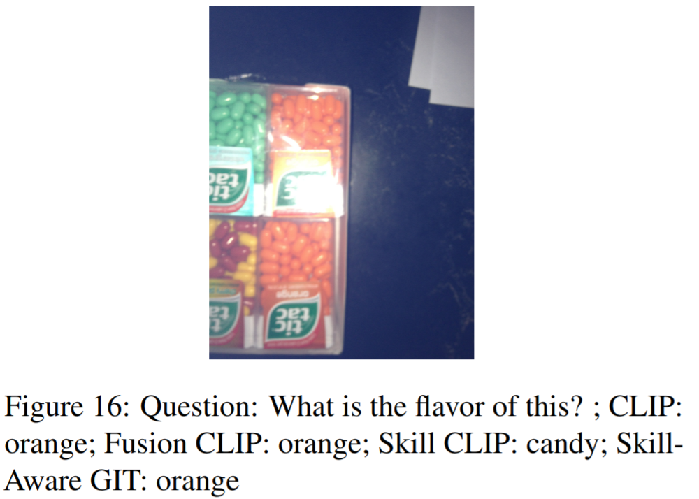

# VizWiz VQA course project Multi Modal Machine Learning

## **Running Instructions**
1. **Download data:**

Download skill data:
```
cd data/skill
bash download_data.sh
```

Download VQA data:
```
cd data/VQA
bash download_data.sh
```

2. **Run model (SkillCLIP) variants:**

With everything:
```
python -m src.main_model.clip_late_fusion -t -de "cuda:0"
```

Without skill embeddings:
```
python -m src.main_model.clip_late_fusion -t -de "cuda:0" -exp skill_unaware_clip
```

Without object tags:
```
python -m src.main_model.clip_late_fusion -t -de "cuda:0" -exp skill_aware_clip_nobj -nobj
```

Without scene text:
```
python -m src.main_model.clip_late_fusion -t -de "cuda:0" -exp skill_aware_clip_nsctxt -nsctxt
```

With multi-task training:
```
python -m src.main_model.clip_multitasking.py -t -de "cuda:0" -exp skill_aware_clip_multitasking -pred_file pred.json
```

## **Interesting object detections**
Keys of a keyboard are detected as microwaves with relatively high confidence scores:
1. ```path: val_objects_detected/VizWiz_val_00001474_objects.png``` <br>
    Potential reasons: the image is very zoomed in which might be abnormal.

## **Illustrative Examples:**
Here are some illustrative examples from our error analysis:
`FusionCLIP` refers to the SkillCLIP model without the skill embeddings.





Comparison between our model (`SkillCLIP`) and `FusionCLIP`. 

Some more examples:


