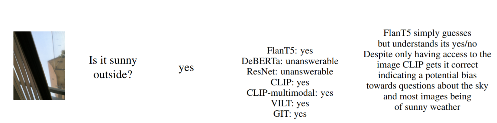

# VizWiz VQA course project Multi Modal Machine Learning

**Interesting object detections**
Keys of a keyboard are detected as microwaves with relatively high confidence scores:
1. ```path: val_objects_detected/VizWiz_val_00001474_objects.png``` <br>
    Potential reasons: the image is very zoomed in which might be abnormal.

**Illustrative Examples:**
Here are some illustrative examples from our error analysis:
`FusionCLIP` refers to the SkillCLIP model without the skill embeddings.



Comparison between our model (`SkillCLIP`) and `FusionCLIP`. 

Some more examples:

